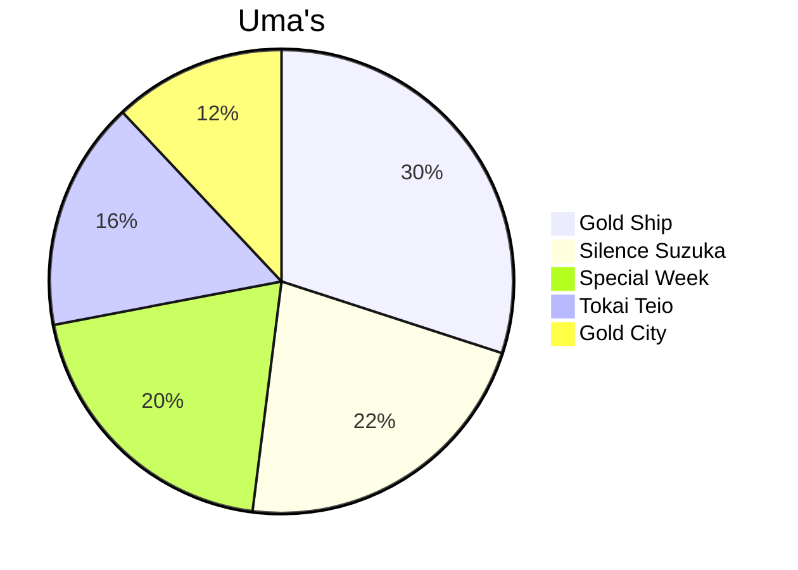

# Umamusume: Pretty Derpy

**Umamusume** - является японской медиафраншизой, созданная компание Cygames. Данная франшиза включает в себя видеоигры, аниме, мангу, музыкальные выступления и другие медиа-проекты. Она получила широкую популярность в Японии, оказав заметное влияние на интерес к конному спорту по всему миру.

## Реальные скачки и с чего всё началось

Японские скачки начались в конце XIX века, но современная система JRA - Japan Racing Association сформировалась в 1954 году. Именно тогда появились главные гонки, которые позже и стали сюжетом для игры Umamusume.

- Tokyo Yushun (Японское дерби) - главная гонка.

- Тройная корона - три ключевые гонки сезона (Сатсуки Шо, Японский дерби, Кикука Шо)

- Japanee Cap и Arima Cinen - междунарожные и финальные гонки года.

Создатели же проета взяли **реальные биографии** этих лошадей: их победы, поражения, характеры, и даже клички - и превратили их в персонажей. Но сами скачки - это документальная история реального спорта.

> Silence suzuka - жеребец победивший в 6 гонка, но в одной из них сломал копыто и жеребца пришлось усыпить

### Умамусуме. Кто это и сама игра.

Действие франшизы ***Umamusume: Pretty Derpy*** происходит в вымышленной вселенной, похожим на современный, где вместе с людьми живут так называемые ***ума мусуме*** - т.е девушки-пони. 

Действие игры происходит в альтернативной Японии, где существуют умамусуме (девушки пони) унаследовавшие дух и талант легендарных скаковых лошадей. Они учатся в академии ***Трэсен***. и мечтают победить в главных гонках.

Главной целью игрока является: стать тренером умамусуме и привести её к победе в трёх коронных гонках.

### Тренировки

Вы прокачиваете своего персонажа за ограниченное время. Необходимо балансировать на 5 характеристиках: **Скорость(Speed), Выносливость(Stamina), Сила(Power), Гибкость(Guts), Интеллект(Wit).**
Параллельно качаете настроение и энергию. Чем меньше энергии, тем вероятнее шанс облажаться и испортить настроние лошадки. Настроение так же влияет на результат скачек и её тренировки.

### Гонки

Во время тренировок персонаж учавствует в забегах. Результат зависит соответственно от прокачки и стратегии. А так же игроку необходимо выполнить определенные цели по типу: занять 1 место, набрать 5000 фанатов и тому подобное.

### Гача

Гача представляет из себя способ получения новых персонажей для будущих тренировок и забегах. Из них помимо новых персонажей и скинов на них возможно выбить **поддерживающие карты**(support cards), которые усиливают тренировки.

## Рейтинг популярных Умамусум на данный момент

### Таблица Умамусум

| Место | Персонаж | Причины хайпа |
| ----- | -------- | ------------- |
| 1     | Gold Ship | Мемный и непредсказуемый. |
| 2     | Silence Suzuka | Трагичная история, стиль бега. |
| 3     | Special Week | Главная героиня аниме, являющаяся лицом франшизы.|
| 4     | Tokai Teio | Драма с травмами, гений с хрупкими ногами, милота. |
| 5     | Gold City  | Популярна за стиль, характер и внешность. |

### Диаграмма популярности.

- [Официальный сайт игры и франшиза](https://umamusume.com/)
