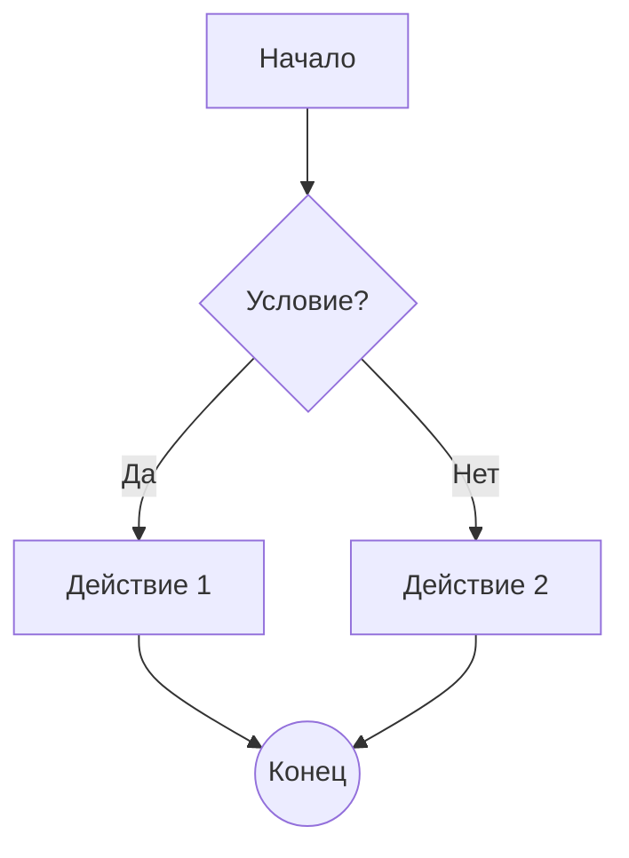
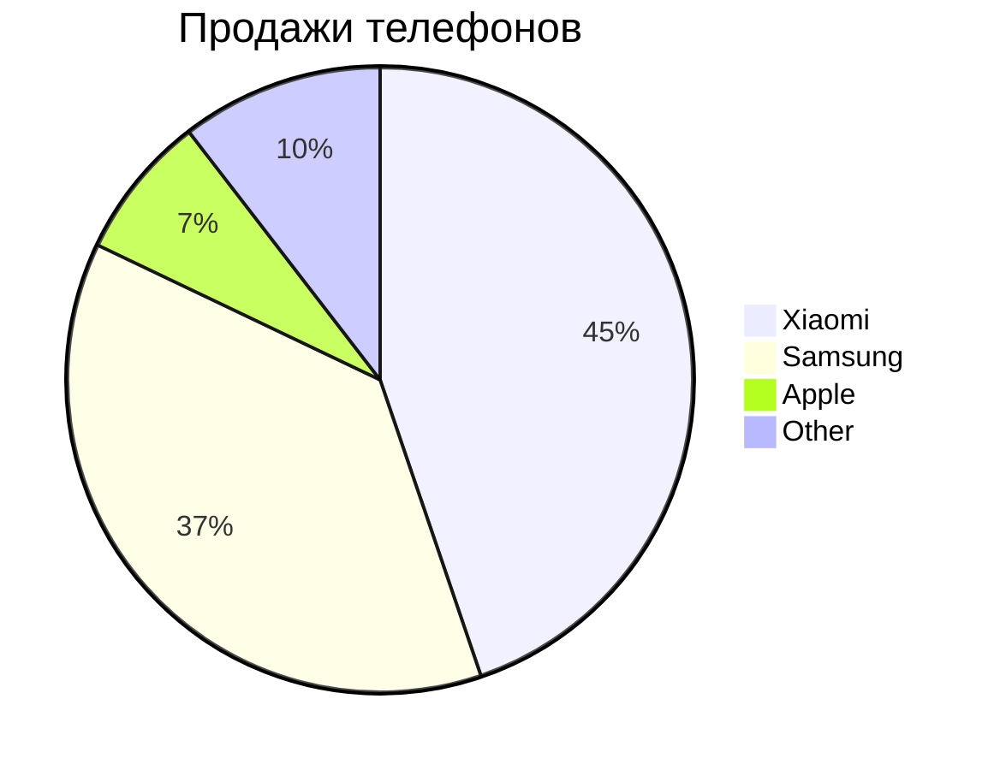
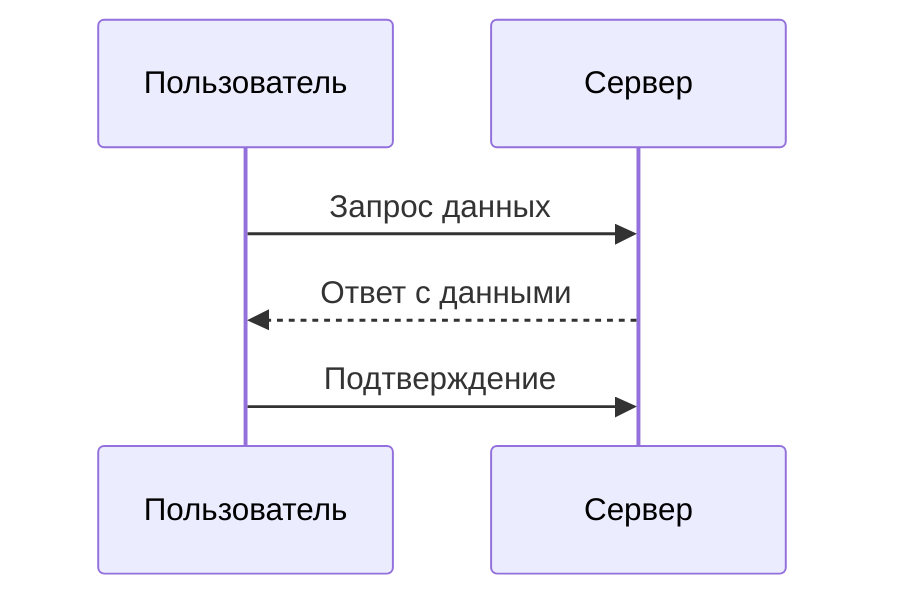
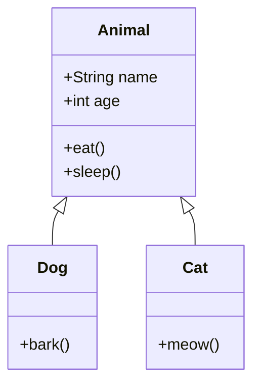
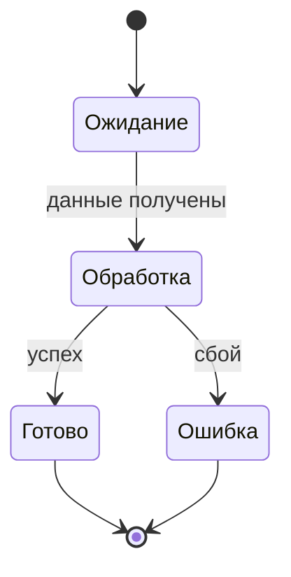
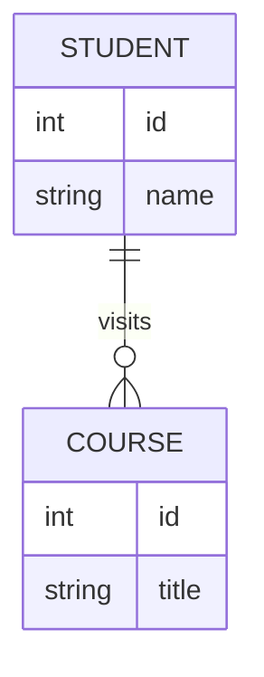
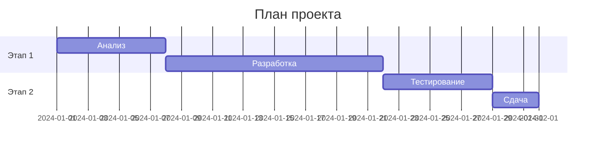
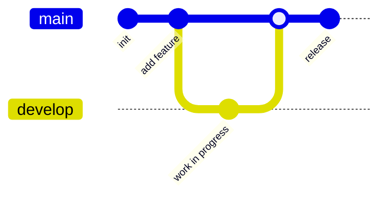
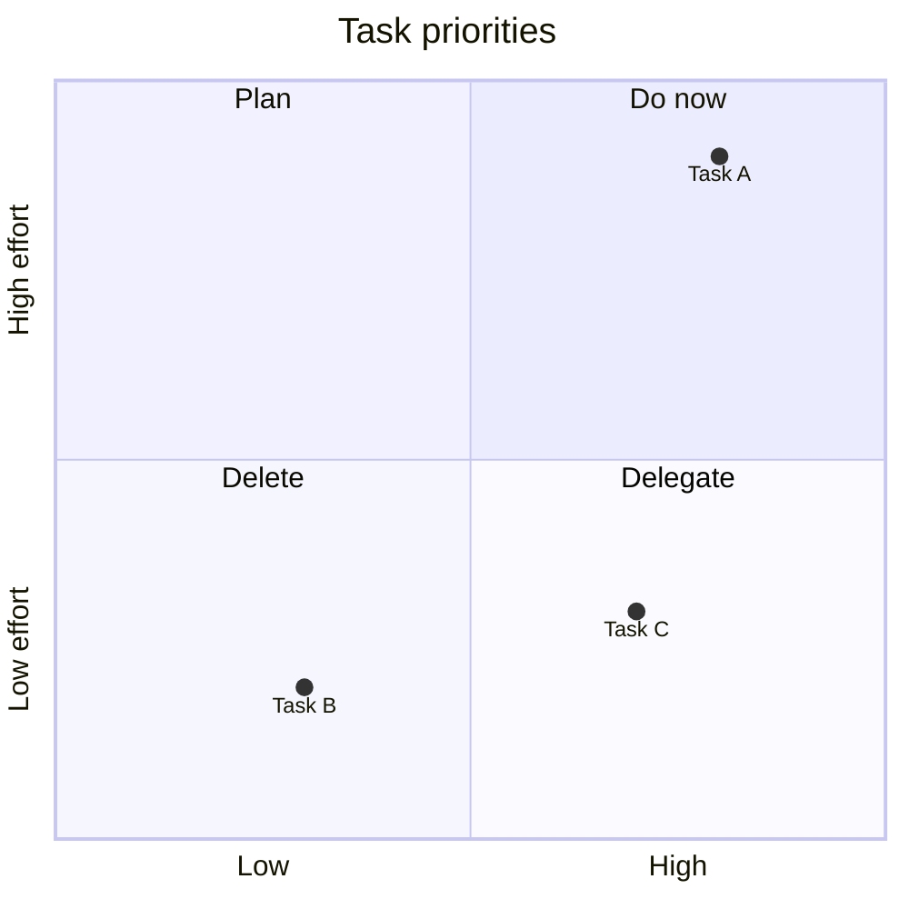
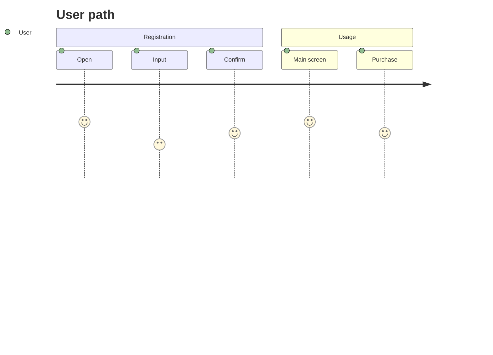

#### Блок-схема

#### Круговая диаграмма

#### Диаграмма последовательности

#### Диаграмма классов

#### Диаграмма состояний

#### ER-диаграмма

#### Диаграмма Ганта

#### Диаграмма потоков

#### Квадрантная диаграмма

#### Диаграмма путешествия пользователя

